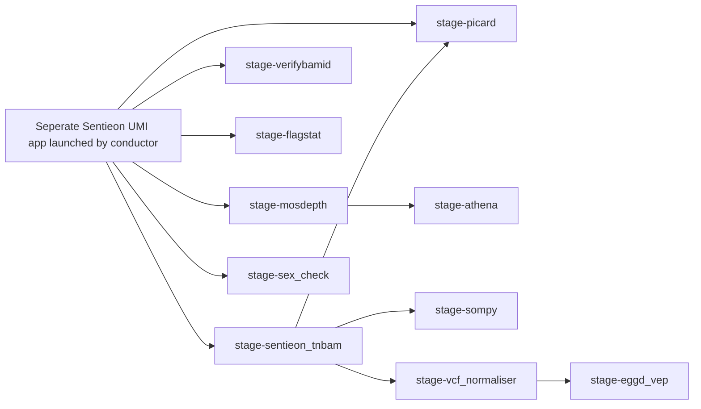

# eggd_atlas_main_workflow  (DNAnexus Platform Workflow)
DNAnexus workflow for solid cancer pipeline (Atlas) for the Twist CGP assay.
This is a DNAnexus workflow that implements the Atlas pipeline for solid cancer samples.
The workflow is designed to process sequencing data generated from the Twist CGP assay, performing alignment, variant calling, and annotation for small variants and gather QC metrics.

---

## What apps are used in this workflow?

| App                            | Version |
| ------------------------------ | ------- |
| sentieon-tnbam                 | 5.1.0   |
| eggd_verifybamid               | 2.3.0   |
| eggd_picard_QC                 | 1.4.0   |
| eggd_samtools_flagstat         | 1.1.0   |
| eggd_mosdepth                  | 1.2.0   |
| eggd_athena                    | 1.6.2   |
| eggd_sex_check                 | 1.2.1   |
| eggd_sompy                     | 1.0.5   |
| eggd_vcf_normaliser            | 1.0.0   |
| eggd_vep                       | 1.3.0   |

## Workflow Diagram

