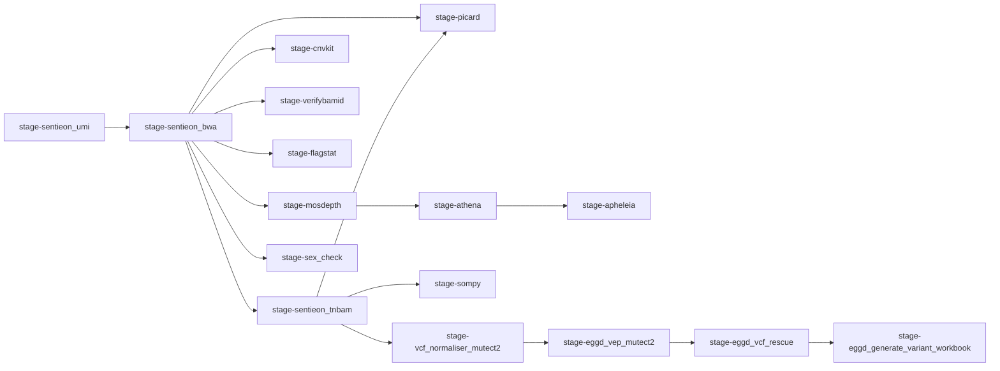

# eggd_atlas_main_workflow  (DNAnexus Platform Workflow)
DNAnexus workflow for solid cancer pipeline based on the Uranus workflow.

---

## What apps are used in this workflow?

| App                            | Version |
| ------------------------------ | ------- |
| eggd_sentieon_umi              | 1.0.0   |
| sentieon-tnbam                 | 5.1.0   |
| eggd_verifybamid               | 2.2.1   |
| eggd_picard_QC                 | 1.3.0   |
| eggd_samtools_flagstat         | 1.1.0   |
| eggd_mosdepth                  | 1.1.0   |
| eggd_athena                    | 1.4.0   |
| eggd_sex_check                 | 1.1.0   |
| eggd_sompy                     | 1.0.5   |
| eggd_apheleia                  | 1.0.1   |
| eggd_vep                       | 1.3.0   |
| eggd_vcf_rescue                | 1.2.0   |
| eggd_generate_variant_workbook | 2.11.1  |

## Workflow Diagram

